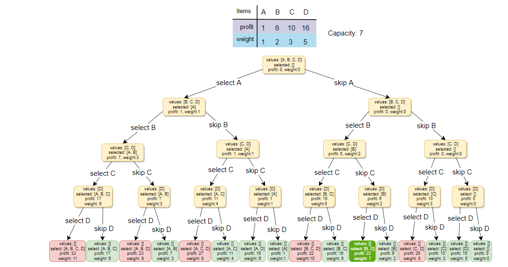
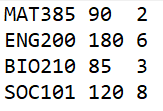
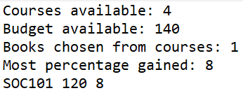

# mat385-group-project

Team Members

#### Ludiana Atnafu

✔️Hello, my name is Ludiana I am a Junior majoring in Computer Science and minoring in Biology. I am from Ethiopia and I currently work as a research assistant in the Computer science department. I am interested in finding ways I can apply Computer science and Biology to solve day to day problems.

#### Teddy Amare

✔️Hi there 😀! My name is Teddy Amare and I am a Sophomore at Northern Kentucky University majoring in Computer Science with a minor in Honors.

# Budgetwise: Dynamic Programming based Knapsack


Github Link: https://github.com/teddygizachew/mat385-group-project

Dynamic programming is an algorithmic technique for solving an optimization problem by breaking it down into simpler subproblems and utilizing the fact that the optimal solution to the overall problem depends upon the optimal solution to its subproblems in a recursive manner. The knapsack algorithm is a famous Dynamic Programing problem that falls in the optimization category. There are various examples showing the application of knapsack, however, the most known is a scenario where a set of items have specific weights and are assigned a monetary value. The goal is to maximize the value in the knapsack(bag) while it has weight constrain.

For our project, we wanted to use knapsack for solving a real-world problem we may face as a college student. The problem we chose to work on is how a student can get as much books as they can while being under a budget constrain. We wrote a Dynamic program that uses knapsack algorithm to solve this problem, and we called our program Budgetwise. The Scenario of our project is explained below.

[[Image:bookstore.jpg|300px]]


## Scenario

It is the first week of class and you, a college student wants to buy your books from the bookstore. However, you do not have enough money to buy all the books for all your courses, so you try to get as many course books as you can while being under budget. The problem is you have an assignment for each of your courses that are due at the same day and are worth varying percentage points for the courses. To make the best decision, you have to take into consideration the percentage points each assignment has and try to choose the books that can get you to earn as many points as possible while being under your budget.

## Why did we choose this topic?

* The idea of applying the knapsack's algorithm into the real world was interesting to us because of how it puts into consideration the constraints while trying to make the best decision that can best benefit the person. In our day-to-day life, we are consistently having to make such decisions, and so having to make a program that can help in making the best decision would be beneficial. Especially as a college student, we believe that this program can be a helpful tool to use.

## How is topic related to Discrete Math?

* The Knapsack algorithm uses a Recurrence relation, which relates this project to one of the topics that we have learned in Discrete Mathematics. This algorithm is familiar to both of us as we have learned it in our Data Structures and Algorithms class.

## Languages and Technologies Used

* [https://www.freecodecamp.org/news/demystifying-dynamic-programming-3efafb8d4296/ Dynamic Programming] - Read more!
* [https://en.wikipedia.org/wiki/Java_(programming_language) Java]
* [https://en.wikipedia.org/wiki/Recurrence_relation Recurrence_relation]

## The Algorithm



The program starts by asking the user for input. The inputs are listed below:

```
Enter the total budget: 150
Enter the name of input file: BooksList.txt
Enter the name of output file: result.txt
```

The user will enter the budget they have to buy the course materials for that semester. We decided to read the inputs from a file because the user might have a large number of data sets.
The input includes a course name, price for the required materials in that course and the total number of percentage gained for buying the book in that course to do the assignments.
The following image shows what the input might look like:

<br>


<br>

The result will also be written to a file rather than being displayed in the terminal. After we get the input, we will be using the budget to determine the best selection of books that will gain the user the most points according to the specific metrics (in our case, the most percentage gained).

We created a Course object that contains the book, it's price and total percentage.

```
public static class Course {
        private final String bookName;
        private final int bookPrice;
        private final int percent;

        public Course(String bookName, int bookPrice, int percent) {
            this.bookName = bookName;
            this.bookPrice = bookPrice;
            this.percent = percent;
        }
    }
```

The following short extract from our program shows how the algorithm chooses the max possible amount of points within the book price range.

```
Course course = coursesList.get(j - 1);
if (course.bookPrice > i) {
    knapsack[i][j] = knapsack[i][j - 1];
} else {
    knapsack[i][j] = Math.max(knapsack[i - course.bookPrice][j - 1] + course.percent, knapsack[i][j - 1]);
}
```

Output



Summary
The knapsack problem is just one of many applications of dynamic programming with the use of recurrence relations. Dynamic Programming is a technique of breaking down a problem into subproblems, solving these subproblems once, and storing their solutions. By storing these solutions, we can simply check them if the same problem resurfaces. Doing this saves us a lot of computation time since we don't have to calculate the solution again.

= Next Steps =
The following step moving forward would be implementing a user interface. One easy approach would be to use JavaFX. We could add additional functionality to the program by providing a more customized and personalized input.

Contribution

#### Ludiana

#### Teddy

# Reference

* https://www.freecodecamp.org/news/demystifying-dynamic-programming-3efafb8d4296/
* https://www.educative.io/courses/grokking-dynamic-programming-patterns-for-coding-interviews/m2G1pAq0OO0
* https://www.section.io/engineering-education/introduction-to-dynamic-programming/#:~:text=Dynamic%20Programming%20(DP)%20is%20an,DP%20and%20how%20it%20works.

